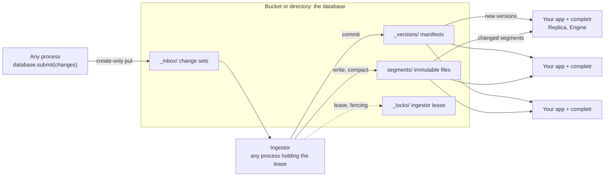

<p align="center">
  <picture>
    <source media="(prefers-color-scheme: dark)" srcset="assets/banner-dark.svg">
    
  </picture>
</p>

<p align="center">
  An embedded autocompletion engine whose database is a bucket. No servers to run.<br>
  Exact, prefix, infix, abbreviation, spelling-tolerant, word-decomposing and semantic completions,<br>
  ranked by popularity and served in well under a millisecond.
</p>

<p align="center">
  <a href="#quick-start">Quick start</a> ·
  <a href="https://sayef.github.io/completr/">Docs</a> ·
  <a href="https://docs.rs/completr">Rust docs</a> ·
  <a href="https://sayef.github.io/completr/reference/python/">Python API</a> ·
  <a href="docs/architecture.md">Architecture</a> ·
  <a href="#benchmarks">Benchmarks</a> ·
  <a href="CHANGELOG.md">Changelog</a>
</p>

<p align="center">
  <a href="https://github.com/sayef/completr/actions/workflows/ci.yml"></a>
  <a href="https://crates.io/crates/completr"></a>
  <a href="https://docs.rs/completr"></a>
  <a href="https://pypi.org/project/completr/"></a>
  
  <a href="LICENSE"></a>
</p>

<p align="center">
  
</p>

completr is a **serverless autocompletion engine**. In the spirit of [LanceDB](https://github.com/lancedb/lancedb),
it is a library, not a service: your application embeds it (Rust, or Python through first-class bindings),
and an object-store bucket or a local directory is the database. There is no cluster to deploy, scale,
upgrade or keep alive. Every process that serves completions reads the index straight from storage, and
writers coordinate through the storage itself.

You give it documents (an id, a text, a popularity weight, and optionally aliases and an embedding), and it
completes what your users type: every kind of match an autocomplete box needs, ranked together, and kept
fresh while your data changes.

## Contents

- [Serverless by design](#serverless-by-design)
- [Features](#features)
- [What it completes](#what-it-completes)
- [Installation](#installation)
- [Quick start](#quick-start)
- [Guides](#guides): [documents](#documents), [filtering](#filtering-by-context), [layers](#layers), [semantic and hybrid](#semantic-and-hybrid-completion), [live updates](#serverless-databases-and-live-updates), [asyncio](#asyncio), [command line](#command-line), [configuration](#configuration)
- [Benchmarks](#benchmarks)
- [Guarantees and testing](#guarantees-and-testing)
- [Non-features](#non-features)
- [FAQ](#faq)
- [Contributing](#contributing) · [License](#license)

## Serverless by design



- **Storage is the only shared component.** Manifests, segments, the change-set inbox and the ingestor lease are
  plain objects on S3, GCS, Azure or a file system. Nothing else runs between your processes.
- **Commits are create-only writes.** Version `N + 1` is written with `If-None-Match` (exclusive create on a
  file system), so concurrent writers never corrupt each other; a loser rebases or retries.
- **Ingestion is a role, not a service.** Any process may run an `Ingestor`; the one holding an expiring,
  fenced lease commits the inbox, and another takes over when it stops.
- **Readers scale with your application.** Each serving process runs a `Replica` that loads only changed,
  immutable segments (memory-mapped from local disk or the optional disk cache) and switches versions
  atomically. Add capacity by adding
  replicas of your own app.
- **Queries never leave the process**, so there is no network hop on the hot path.

## Features

**Matching**
- **Exact and prefix completion** as users type, over whole titles and their words.
- **Infix matching**: `science` finds *Data Science*.
- **Abbreviations**: `ML` completes *Machine Learning*. Abbreviations match exactly, so short codes do not
  flood the results.
- **Synonyms**: alternative names that are prefix-searchable and point back to their document.
- **Spelling correction** of up to two edits per word, SymSpell-style, verified with
  [rapidfuzz](https://github.com/rapidfuzz/rapidfuzz-rs): `machne lerning` finds *Machine Learning*.
- **Word decomposition**: run-together input such as `datascience` is split into words and completed.
- **Semantic completion** from embeddings of any model, quantised to 2-4 bits.
- **Hybrid completion** with reciprocal rank fusion, weighted blending or lexical-first ordering, chosen per
  request.
- **Context filters**: restrict any request to documents tagged with a category, tenant or language.
- **Your own ids**: integers or strings such as UUIDs, returned with every suggestion as given. Documents
  with the same title stay separate results.

**Ranking**
- **Popularity** through a per-document weight, combined with match kind, text length and whole-word
  bonuses.
- Every suggestion carries its **text, match kind and highlight ranges**, so your UI renders it directly.
- **Deterministic**: identical inputs give bit-identical scores and order, with ties broken by id.

**Serving**
- **Fast**: p50 around 0.1 ms and p99 around 1 ms for typed queries on 200k documents, on one core.
- **Zero-copy segments**: an aligned, checksummed binary format read in place through `mmap`. Opening a
  segment takes under a millisecond and reads only its headers. Texts are FSST-compressed and decoded one
  at a time.
- **Compact dictionaries**: a purpose-built LOUDS trie for keys that are scanned, and
  [`fst`](https://crates.io/crates/fst) for keys that are looked up, chosen per key set.
- **Streaming builds**: documents stream into a `SegmentBuilder` (`Segment.build(rows, path=...)` in
  Python), which keeps them compactly and writes each section to the file as it is produced. Indexing the
  124,440 HN titles takes 0.38 s and peaks at 73 MB.
- **Override layers**: search a tenant's, a user's or an experiment's index on top of shared data, per
  document id, without copying it.
- A **short-query cache** for one- to three-character prefixes, carried across index versions.

**Serverless updates**
- **Immutable segments**, as in Lucene and LanceDB: updates land as small delta segments, and tiered
  compaction merges them in the background.
- **Versioned databases** on local disk, S3, GCS, Azure or memory, with optimistic transactions and conflict
  detection.
- **One ingestor, many replicas**: any process submits change sets, and a lease-elected `Ingestor`
  commits them in order. Replicas load only changed segments and switch versions atomically, without doubling memory.
- **Credentials like `boto3`**: environment, profiles, SSO, web identity, ECS and IMDS.

**Developer experience**
- Documents as dicts, `completr.Document` objects, or pandas, polars and Arrow tables, with int or string ids.
- `completr.connect(url)`, an asyncio API, typed stubs and a clear exception hierarchy.
- A `completr` command-line tool, and `tracing` events that also reach Python's `logging`.

## What it completes

Real results from the index behind the demo above (25 short titles with popularity weights):

| Query | Top completion | Kind | Capability |
|---|---|---|---|
| `mach` | Machine Learning, Machine Vision, Machine Translation | `prefix` | completion by popularity |
| `nlp` | Natural Language Processing | `abbreviation` | abbreviations, case-insensitive |
| `science` | Data Science, Computer Science, Political Science | `infix` | matches inside titles |
| `machne lerning` | Machine Learning | `fuzzy` | spelling correction, two words |
| `datascience` | Data Science | `exact` | word decomposition |
| `data analytics` | Data Science | synonym | `complete_aliases` |

## Installation

```sh
pip install completr
```

```sh
cargo add completr                                        # engine
cargo add completr --features store                       # plus databases on local disk and in memory
cargo add completr --features aws-credentials,gcp,azure   # plus S3, GCS and Azure
```

| Cargo feature | Adds |
|---|---|
| `store` | `Database`, `Transaction`, `Ingestor`, `Replica`, local and in-memory stores |
| `aws` / `gcp` / `azure` | S3, Google Cloud Storage, Azure Blob Storage |
| `aws-credentials` | S3 credentials through the AWS SDK chain |

The Python wheel includes all features. It is abi3 for CPython 3.11+, and releases the GIL while it
searches and builds.

## Quick start

### Python

```python
from completr import Index

docs = [
    {"id": "ml", "text": "Machine Learning", "popularity": 0.9, "abbreviations": ["ML"]},
    {"id": "mv", "text": "Machine Vision", "popularity": 0.4},
    {"id": "ds", "text": "Data Science", "popularity": 0.7, "synonyms": ["data analytics"]},
]
index = Index.from_documents(docs)   # also accepts completr.Document objects, pandas, polars or Arrow tables

for query in ["mach", "ML", "vison", "science"]:
    print(query, [(s.text, s.kind, round(s.score, 3)) for s in index.complete(query, limit=3)])
```

```text
mach    [('Machine Learning', 'prefix', 0.596), ('Machine Vision', 'prefix', 0.337)]
ML      [('Machine Learning', 'abbreviation', 0.596)]
vison   [('Machine Vision', 'fuzzy', 0.09)]
science [('Data Science', 'infix', 0.299)]
```

Each suggestion carries its `id` (an int or the string you gave), `text`, `score`, `kind`, and
`highlights`: character ranges of the text that matched, ready to render in bold.

```python
top = index.complete("mach")[0]
[top.text[a:b] for a, b in top.highlights]   # ['Mach']
```

### Rust

```rust
use completr::{Document, Index};

let index = Index::from_documents([
    Document::keyed("ml", "Machine Learning", 0.9).with_abbreviation("ML"),
    Document::keyed("mv", "Machine Vision", 0.4),
    Document::keyed("ds", "Data Science", 0.7).with_synonym("data analytics"),
])?;

for s in index.complete("mach", 10) {
    println!("{} {} {:.3} {:?}", s.text, s.kind.as_str(), s.score, s.highlights);
}
```

Runnable versions: [`quickstart.rs`](crates/completr/examples/quickstart.rs) and
[`quickstart.py`](crates/completr-py/examples/quickstart.py).

## Guides

### Documents

| Field | Type | Meaning |
|---|---|---|
| `id` | `int` or `str` | Your identifier. String ids are hashed to a stable 64-bit id and returned as given. |
| `text` | `str` | What is completed and displayed. |
| `popularity` | `float` | Usually in `[0, 1]`; more popular documents rank higher. |
| `synonyms` | `list[str]` | Alternative names, searchable with `complete_aliases`. |
| `abbreviations` | `list[str]` | Codes such as `ML`, matched exactly by `complete`. |
| `contexts` | `list[str]` | Tags that requests can filter on, e.g. a category or tenant. |
| `vector` | float array | Optional embedding; or pass `vectors=` for all documents at once. |

Unknown fields raise `InvalidInputError`, so a typo never silently drops data.

### Filtering by context

Tag documents with `contexts` and restrict any request to them. Filtering happens while candidates are
collected, so a filtered request still returns up to `limit` results.

```python
index.complete("mach", contexts=["books"])
engine.complete("mach", ["shared", "acme"], contexts=["books", "courses"])   # any of the contexts
```

### Layers

An `Engine` holds indexes by name and publishes new versions atomically. When you search several layers,
later layers override earlier ones per document id, so a tenant's edits, deletions and additions shadow
the shared data.

```python
from completr import Engine

engine = Engine()
engine.publish({"shared": shared_index, "acme": acme_index})
engine.complete("machine", ["shared", "acme"], limit=10)   # suggestion.layer tells where it came from
engine.publish({"acme": None})                             # remove a layer
```

### Semantic and hybrid completion

Documents can carry embeddings from any model. completr quantises them with
[TurboQuant](https://crates.io/crates/turbovec) (4 bits by default, 2 or 3 optional) and searches them with
deleted and filtered-out documents masked out.

```python
vectors = embed([d["text"] for d in docs]).astype("float32")   # shape (n, dim)
index = Index.from_documents(docs, vectors=vectors, vector_bits=4)

index.vector_search(embed(["deep learning"])[0], limit=10)   # kind == "semantic"
index.hybrid_search("deep lea", embed(["deep lea"])[0], limit=10, fusion="rrf")
```

| Fusion | Score |
|---|---|
| `rrf` (default) | `1 / (k + lexical_rank) + 1 / (k + semantic_rank)`, `k = 60`, no calibration needed |
| `weighted` | `(1 - w) * lexical + w * max(semantic, 0)`, set `semantic_weight` |
| `lexical_first` | lexical hits in their order, then semantic-only hits |

A hybrid suggestion keeps its lexical match kind when it matched lexically, and reports both source scores.

### Serverless databases and live updates

`completr.connect` opens a versioned database of named indexes in a directory or bucket. Transactions commit
atomically, and concurrent commits either rebase or, in strict mode, fail with `ConflictError`.

```python
import completr

db = completr.connect("s3://my-bucket/completions")   # or a local path, gs://..., az://..., memory:///...

txn = db.begin()
txn.append("products", [{"id": f"p{i}", "text": f"product {i}"} for i in range(10_000)])
txn.commit()

# Serving processes: an engine that follows the database, loading only changed segments.
engine = db.engine()
engine.sync()                                        # call periodically, e.g. every few seconds

# Any process: submit changes.
changes = completr.ChangeSet()
changes.upsert("products", [{"id": "kb-1", "text": "Wireless Keyboard", "popularity": 0.9}])
changes.delete("products", ["p42"])
db.submit(changes)

# One process at a time commits them (lease-elected), then compacts.
completr.Ingestor(db, "ingestor-1").run_once()         # call in a loop
```

Runnable: [`live_updates.py`](crates/completr-py/examples/live_updates.py) and
[`live_updates.rs`](crates/completr/examples/live_updates.rs).

- **Snapshots**: `db.open_index("products")` returns one version of one index, for scripts and tests.
- **Compaction**: `db.compact(index)` merges delta segments tier by tier, and rebuilds the base when too
  many documents are superseded. The ingestor compacts automatically after committing.
- **Cleanup**: `db.cleanup(keep_versions=10, older_than_seconds=3600)` deletes old manifests, and segment
  files that no retained version references.
- **Credentials**: S3 uses the standard AWS chain. Override it with
  `options={"aws_access_key_id": ..., "aws_region": ...}`, and pass `cache_dir=...` to keep downloaded
  segments on local disk.

### asyncio

`completr.connect_async` returns the same database with awaitable storage operations, for FastAPI and other
asyncio services. Completions stay synchronous: they take well under a millisecond.

```python
db = await completr.connect_async("s3://my-bucket/completions")
engine = await db.engine()
await engine.sync()
engine.complete("wirel", ["products"])
```

### Command line

The `completr` tool operates a database from a terminal or a cron job. Every command takes the database URL
first (or `COMPLETR_URL`).

```sh
cargo install completr-cli

completr s3://my-bucket/completions import products products.jsonl   # JSON Lines documents
completr s3://my-bucket/completions complete products "wirel" --contexts peripherals
completr s3://my-bucket/completions inspect                          # versions, indexes, sizes
completr s3://my-bucket/completions compact products
completr s3://my-bucket/completions cleanup --keep-versions 10
completr s3://my-bucket/completions ingest --interval 1               # run an ingestor
```

Engine events are logged to stderr; set `COMPLETR_LOG=completr=debug` for more.

### Errors

Every error derives from `completr.CompletrError`: `ConflictError`, `CorruptionError`, `NotFoundError`,
`InvalidInputError` (also a `ValueError`) and `StorageError` (also an `OSError`).

### Configuration

| Where | Settings |
|---|---|
| `Segment.build` / `Index.from_documents` / `connect(...)` | `min_word_chars`, `max_edit_distance`, `fuzzy_prefix_chars`, `vector_bits`, `compact_keys`, `build_threads`; `Segment.build` also `path` |
| `Index(...)` / `db.open_index(...)` / `db.engine(...)` | `max_score`, `popularity_weight`, `short_query_chars`, `short_query_limit`, `short_query_cache_entries`, `vector_threads` |
| `complete`, `complete_aliases`, `vector_search` | `limit`, `contexts` |
| `hybrid_search` | `limit`, `fusion`, `rrf_k`, `semantic_weight`, `candidates`, `contexts` |
| `db.engine(...)` / `Engine(...)` | `overfetch` for layered searches, `group_separator` to switch indexes group by group |
| `db.compact(...)` | `fanout`, `max_segments`, `max_hidden_fraction` |
| `Ingestor(...)` | `lease_ttl_seconds`, `max_change_sets`, `compact` |

In Rust, `BuildOptions`, `IndexOptions`, `SearchOptions`, `HybridOptions`, `CompactionPolicy` and
`CleanupPolicy` expose the same settings through chainable setters, e.g.
`IndexOptions::default().max_score(742.0)`.

## Benchmarks

**Against other engines.** On 124,440 Hacker News titles, typed character by character, completr ranks the
wanted title best of the engines tested, both while typing cleanly (MRR 0.861, against 0.846 for
Meilisearch, 0.804 for tantivy and 0.784 for Typesense) and with a typo (0.827, against 0.804 for
Meilisearch). In process it answers in 0.17 ms at the median and under 1 ms at p99 for every query set,
and serves 30,000 queries per second on 8 threads. Its 23 MB segment opens in about a millisecond.
Full tables, a capability comparison, where the bytes go, settings and caveats are in
[docs/benchmarks.md](docs/benchmarks.md); the harness is in [`bench/`](bench/).

**On a synthetic corpus.**

A synthetic corpus of 200,000 documents (1 to 4 words from a 30,000-word vocabulary, Zipf-distributed), on
one core of an Apple M1 Pro. Reproduce with
`cargo run --release -p completr --example bench -- 200000 --vectors`.

| Step | Result |
|---|---|
| Build a segment | 317 ms, 11.6 MB |
| Open a segment (memory-mapped) | 0.5 ms |
| Build a delta segment of 1,000 upserts | 8.1 ms |

| Query, limit 10 | p50 | p99 |
|---|---|---|
| Every prefix of 2,000 titles, as typed (33,744 queries) | 0.07 ms | 4.0 ms |
| The same, with the short-query cache (default) | 0.04 ms | 0.32 ms |
| The same, over a base plus a delta segment | 0.09 ms | 4.3 ms |
| One-edit typos | 0.15 ms | 0.67 ms |
| Vector search, 256-d, 4-bit | 1.1 ms | 1.2 ms |
| Hybrid search (RRF) | 1.3 ms | 5.6 ms |

The vector rows come from the same run with `--vectors`, whose segment is 38.8 MB.

One- and two-character prefixes, which match large parts of the corpus, dominate the tail. The short-query
cache serves them, and replicas carry its hottest entries across index versions.

## Guarantees and testing

- **Determinism**: results depend only on the documents and settings, not on how the index was segmented,
  compacted or queried concurrently. The tests re-run queries sampled under concurrent updates, on the same
  snapshot and on a freshly built index, and require bit-identical output.
- **Concurrency**: readers never block. New index versions are published atomically, and a reader keeps
  the version it started with.
- **Integrity**: every segment ends with an xxh3 checksum. `Segment::open` checks a local file's structure
  only; `Segment::verify`, `Segment::from_bytes` and downloads into a store's cache check the checksum and
  every section. Stable-Rust fuzz tests feed in truncated, bit-flipped and garbage segments, random Unicode
  queries and corrupted manifests.
- **Memory**: replicas replace indexes group by group, and release old segments before loading the next
  group. In a soak test over thousands of versions, serving memory stayed flat.

```sh
cargo test --release -p completr --features store          # unit, database, concurrency and fuzz tests
COMPLETR_FUZZ_ITERS=1000000 cargo test --release -p completr --features store --test fuzz
```

## Non-features

completr does one job. It deliberately does not include:
- a server or HTTP API; it is serverless by design, so expose it through your own API if you need one;
- full-text search over long documents, filtering or faceting;
- multi-field schemas; each document has one text, plus aliases and an optional embedding;
- built-in embedding models; bring vectors from any model;
- sharding across machines; one index is expected to fit on one machine, memory-mapped.

## FAQ

**What does "serverless" mean here?**
The same as for LanceDB: there is no completr server. The engine is a library in your process, and the
database is a set of files in a bucket or directory. Your application is still deployed however you like,
on containers, VMs or functions; completr adds no extra service to it.

**How does completr differ from Elasticsearch, OpenSearch, Typesense or Meilisearch?**
Those are search servers for documents with many fields, filters and facets: you run and scale a cluster,
and every query crosses the network. completr is serverless and does autocompletion only: it runs inside
your process, and ranks the match kinds a completion box needs (abbreviations, spelling correction, word
decomposition) together with popularity. Many applications use both: a search server for the results page,
completr for the box.

**How do several writers avoid conflicts without a server?**
Through the store. Commits create the next manifest create-only, so exactly one writer wins each version
and the others rebase. For high write rates, processes submit change sets to an inbox, and a single `Ingestor`
elected by an expiring lease commits them in order. Every commit carries the lease generation as a fencing
token, so an ingestor that lost its lease cannot commit.

**How does it differ from an FST or trie library?**
[`fst`](https://crates.io/crates/fst) and [marisa-trie](https://github.com/s-yata/marisa-trie) are
excellent key dictionaries, and completr uses the same ideas internally. On top of them it adds scoring,
typo tolerance, abbreviations, semantic search, updates without rebuilding, and storage.

**Which languages does it support?**
Text is normalised with Unicode lowercasing and split on Unicode whitespace, so any language written with
spaces works as it is. For scripts written without spaces, such as Chinese and Japanese, pass text
segmented into words to get infix matching.

**How large can an index be?**
A segment is memory-mapped and costs roughly 100 bytes per short title, plus about 136 bytes per 256-d
vector at 4 bits. Hundreds of thousands to a few million documents per index fit comfortably on one
machine.

**Why the name?**
*completr* is said "completer": it completes what people type, and the missing vowel is a nod to
search-engine names such as Solr. Its wordmark shows the name being completed as you type it.

## How it works

A segment stores its documents in zstd-compressed blocks, and its keys in three dictionaries: titles,
title words and aliases. SymSpell delete variants for spelling correction are hashed into buckets of word
ordinals. Popularity and title length are kept in aligned columns, and postings are bit-packed. Queries run on primitives merged across segments
(cursor merges over the sorted dictionaries), so an index of many segments ranks exactly like a single
one. See [docs/architecture.md](docs/architecture.md) for the format, the ranking and the database
protocol.

## Status

completr is young. The on-disk format is versioned and checked on load, but it and the API may still change
before 1.0. Feedback and issues are very welcome.

## Contributing

Contributions are welcome. Please read [CONTRIBUTING.md](CONTRIBUTING.md) and the
[Code of Conduct](CODE_OF_CONDUCT.md). To report a vulnerability, see [SECURITY.md](SECURITY.md).

## Acknowledgements

completr builds on excellent work: [`fst`](https://github.com/BurntSushi/fst) by Andrew Gallant,
[`rapidfuzz`](https://github.com/rapidfuzz/rapidfuzz-rs), [`turbovec`](https://crates.io/crates/turbovec),
[`object_store`](https://github.com/apache/arrow-rs-object-store), [`zstd`](https://github.com/gyscos/zstd-rs)
and [PyO3](https://github.com/PyO3/pyo3). Its trie design is inspired by
[marisa-trie](https://github.com/s-yata/marisa-trie), its spelling correction and word decomposition by
[SymSpell](https://github.com/wolfgarbe/SymSpell), and its database protocol by
[Lance](https://github.com/lancedb/lance). The logo and demo use [Inter](https://rsms.me/inter/) outlines.

## License

[MIT](LICENSE). Developed and maintained by [sayef](https://github.com/sayef).
