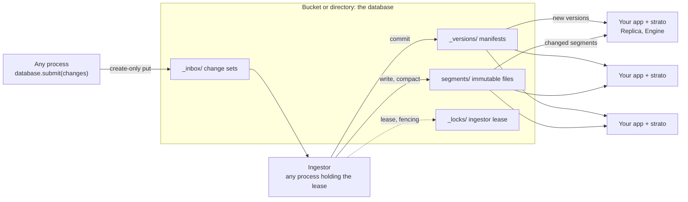

<p align="center">
  <picture>
    <source media="(prefers-color-scheme: dark)" srcset="assets/banner-dark.svg">
    
  </picture>
</p>

<p align="center">
  An embedded autocompletion engine whose database is a bucket. No servers to run.<br>
  Exact, prefix, infix, abbreviation, spelling-tolerant, word-decomposing and semantic completions,<br>
  ranked by popularity and served in well under a millisecond.
</p>

<p align="center">
  <a href="#quick-start">Quick start</a> ·
  <a href="https://docs.rs/strato">Rust docs</a> ·
  <a href="crates/strato-py/python/strato/__init__.pyi">Python API</a> ·
  <a href="docs/architecture.md">Architecture</a> ·
  <a href="#benchmarks">Benchmarks</a> ·
  <a href="CHANGELOG.md">Changelog</a>
</p>

<p align="center">
  <a href="https://github.com/sayef/strato/actions/workflows/ci.yml"></a>
  <a href="https://crates.io/crates/strato"></a>
  <a href="https://docs.rs/strato"></a>
  <a href="https://pypi.org/project/strato/"></a>
  
  <a href="LICENSE"></a>
</p>

<p align="center">
  
</p>

strato is a **serverless autocompletion engine**. In the spirit of [LanceDB](https://github.com/lancedb/lancedb),
it is a library, not a service: your application embeds it (Rust, or Python through first-class bindings),
and an object-store bucket or a local directory is the database. There is no cluster to deploy, scale,
upgrade or keep alive. Every process that serves completions reads the index straight from storage, and
writers coordinate through the storage itself.

You give it documents (an id, a text, a popularity weight, and optionally aliases and an embedding), and it
completes what your users type: every kind of match an autocomplete box needs, ranked together, and kept
fresh while your data changes.

## Contents

- [Serverless by design](#serverless-by-design)
- [Features](#features)
- [What it completes](#what-it-completes)
- [Installation](#installation)
- [Quick start](#quick-start)
- [Guides](#guides): [layers](#layers), [semantic and hybrid completion](#semantic-and-hybrid-completion), [live updates](#databases-and-live-updates), [configuration](#configuration)
- [Benchmarks](#benchmarks)
- [Guarantees and testing](#guarantees-and-testing)
- [Non-features](#non-features)
- [FAQ](#faq)
- [Contributing](#contributing) · [License](#license)

## Serverless by design



- **Storage is the only shared component.** Manifests, segments, the change-set inbox and the ingestor lease are
  plain objects on S3, GCS, Azure or a file system. Nothing else runs between your processes.
- **Commits are create-only writes.** Version `N + 1` is written with `If-None-Match` (exclusive create on a
  file system), so concurrent writers never corrupt each other; a loser rebases or retries.
- **Ingestion is a role, not a service.** Any process may run an `Ingestor`; the one holding an expiring,
  fenced lease commits the inbox, and another takes over when it stops.
- **Readers scale with your application.** Each serving process runs a `Replica` that loads only changed,
  immutable segments (memory-mapped from local disk or the optional disk cache) and switches versions
  atomically. Add capacity by adding
  replicas of your own app.
- **Queries never leave the process**, so there is no network hop on the hot path.

## Features

**Matching**
- **Exact and prefix completion** as users type, over whole titles and their words.
- **Infix matching**: `science` finds *Data Science*.
- **Abbreviations**: `ML` completes *Machine Learning*. Abbreviations match exactly, so short codes do not
  flood the results.
- **Synonyms**: alternative names that are prefix-searchable and point back to their document.
- **Spelling correction** of up to two edits per word, SymSpell-style, verified with
  [rapidfuzz](https://github.com/rapidfuzz/rapidfuzz-rs): `machne lerning` finds *Machine Learning*.
- **Word decomposition**: run-together input such as `datascience` is split into words and completed.
- **Semantic completion** from embeddings of any model, quantised to 2-4 bits.
- **Hybrid completion** with reciprocal rank fusion, weighted blending or lexical-first ordering, chosen per
  request.

**Ranking**
- **Popularity** through a per-document weight, combined with match kind, text length and whole-word
  bonuses.
- Every hit reports its **match kind**, so your UI can explain or style results.
- **Deterministic**: identical inputs give bit-identical scores and order, with ties broken by id.

**Serving**
- **Fast**: p50 around 0.1 ms and p99 around 1 ms for typed queries on 200k documents, on one core.
- **Zero-copy segments**: an aligned, checksummed binary format read in place through `mmap`. Opening a
  19 MB segment takes about 6 ms.
- **Compact dictionaries**: a purpose-built LOUDS trie for keys that are scanned, and
  [`fst`](https://crates.io/crates/fst) for keys that are looked up, chosen per key set.
- **Override layers**: search a tenant's, a user's or an experiment's index on top of shared data, per
  document id, without copying it.
- A **short-query cache** for one- to three-character prefixes, carried across index versions.

**Serverless updates**
- **Immutable segments**, as in Lucene and LanceDB: updates land as small delta segments, and tiered
  compaction merges them in the background.
- **Versioned databases** on local disk, S3, GCS, Azure or memory, with optimistic transactions and conflict
  detection.
- **One ingestor, many replicas**: any process submits change sets, and a lease-elected `Ingestor`
  commits them in order. Replicas load only changed segments and switch versions atomically, without doubling memory.
- **Credentials like `boto3`**: environment, profiles, SSO, web identity, ECS and IMDS.

## What it completes

Real results from the index behind the demo above (25 short titles with popularity weights):

| Query | Top completion | Kind | Capability |
|---|---|---|---|
| `mach` | Machine Learning, Machine Vision, Machine Translation | `prefix` | completion by popularity |
| `nlp` | Natural Language Processing | `abbreviation` | abbreviations, case-insensitive |
| `science` | Data Science, Computer Science, Political Science | `infix` | matches inside titles |
| `machne lerning` | Machine Learning | `fuzzy` | spelling correction, two words |
| `datascience` | Data Science | `exact` | word decomposition |
| `data analytics` | Data Science | synonym | `complete_aliases` |

## Installation

```sh
pip install strato
```

```sh
cargo add strato                                        # engine
cargo add strato --features store                       # plus databases on local disk and in memory
cargo add strato --features aws-credentials,gcp,azure   # plus S3, GCS and Azure
```

| Cargo feature | Adds |
|---|---|
| `store` | `Database`, `Transaction`, `Ingestor`, `Replica`, local and in-memory stores |
| `aws` / `gcp` / `azure` | S3, Google Cloud Storage, Azure Blob Storage |
| `aws-credentials` | S3 credentials through the AWS SDK chain |

The Python wheel includes all features. It is abi3 for CPython 3.11+, and releases the GIL while it
searches and builds.

## Quick start

### Python

```python
from strato import Index, Segment

# (id, text, popularity, [(alias, is_abbreviation)])
docs = [
    (1, "Machine Learning", 0.9, [("ML", True)]),
    (2, "Machine Vision", 0.4, []),
    (3, "Data Science", 0.7, [("data analytics", False)]),
]
index = Index([Segment.build(docs)])

for query in ["mach", "ML", "vison", "science"]:
    print(query, [(h.id, h.kind, round(h.score, 3)) for h in index.complete(query, limit=3)])
```

```text
mach    [(1, 'prefix', 0.596), (2, 'prefix', 0.337)]
ML      [(1, 'abbreviation', 0.596)]
vison   [(2, 'fuzzy', 0.09)]
science [(3, 'infix', 0.299)]
```

### Rust

```rust
use std::sync::Arc;
use strato::{AliasKind, Document, Index, IndexConfig, Segment};

let docs = vec![
    Document::new(1, "Machine Learning", 0.9).with_alias("ML", AliasKind::Abbreviation),
    Document::new(2, "Machine Vision", 0.4),
    Document::new(3, "Data Science", 0.7).with_alias("data analytics", AliasKind::Synonym),
];
let index = Index::new(vec![Arc::new(Segment::build(docs, [])?)], IndexConfig::default())?;

for hit in index.complete("mach", 10) {
    println!("{} {} {:.3}", hit.id, hit.kind.as_str(), hit.score);
}
```

Runnable versions: [`quickstart.rs`](crates/strato/examples/quickstart.rs) and
[`quickstart.py`](crates/strato-py/examples/quickstart.py).

## Guides

### Layers

An `Engine` holds indexes by name and publishes new versions atomically. When you search several layers,
later layers override earlier ones per document id, so a tenant's edits, deletions and additions shadow
the shared data.

```python
from strato import Engine

engine = Engine()
engine.publish({"shared": shared_index, "acme": acme_index})
hits = engine.complete("machine", ["shared", "acme"], limit=10)   # hit.layer tells where it came from
engine.publish({"acme": None})                                         # remove a layer
```

### Semantic and hybrid completion

Documents can carry embeddings from any model. strato quantises them with
[TurboQuant](https://crates.io/crates/turbovec) (4 bits by default, 2 or 3 optional) and searches them with
deleted documents masked out.

```python
import numpy as np

vectors = embed([text for _, text, _, _ in docs]).astype(np.float32)   # shape (n, dim)
index = Index([Segment.build(docs, vectors=vectors, vector_bits=4)])

index.vector_search(embed(["deep learning"])[0], limit=10)             # kind == "semantic"
index.hybrid_search("deep lea", embed(["deep lea"])[0], limit=10,
                    fusion="rrf")                                      # or "weighted", "lexical_first"
```

| Fusion | Score |
|---|---|
| `rrf` (default) | `1 / (k + lexical_rank) + 1 / (k + semantic_rank)`, `k = 60`, no calibration needed |
| `weighted` | `(1 - w) * lexical + w * max(semantic, 0)`, set `semantic_weight` |
| `lexical_first` | lexical hits in their order, then semantic-only hits |

A hybrid hit keeps its lexical match kind when it matched lexically, and reports both source scores.

### Databases and live updates

A `Database` is a versioned collection of named indexes in a directory or bucket. Transactions commit
atomically, and concurrent commits either rebase or, in strict mode, fail with `ConflictError`.

```python
from strato import ChangeSet, Database, Engine, Replica, Ingestor

database = Database("s3://my-bucket/completions")    # or a local path, gs://..., az://..., memory:///...

txn = database.begin()
txn.append("products", [(i, f"product {i}", 0.5, []) for i in range(10_000)])
txn.commit()

# Serving processes: load changed segments only, publish atomically.
engine = Engine()
replica = Replica(database, engine)
replica.sync()                                     # call periodically

# Any process: submit changes to the inbox.
changes = ChangeSet()
changes.upsert("products", [(10_000, "wireless keyboard", 0.9, [])])
changes.delete("products", [42])
database.submit(changes)

# One process at a time commits them (lease-elected), then compacts.
ingestor = Ingestor(database, "ingestor-1")
ingestor.run_once()                                   # call in a loop
```

Runnable: [`live_updates.py`](crates/strato-py/examples/live_updates.py) and
[`live_updates.rs`](crates/strato/examples/live_updates.rs).

- **Compaction**: `database.compact(index)` merges delta segments tier by tier, and rebuilds the base when
  too many documents are superseded. The ingestor compacts automatically after committing.
- **Cleanup**: `database.cleanup(keep_versions=10, older_than_seconds=3600)` deletes old manifests, and
  segment files that no retained version references.
- **Credentials**: S3 uses the standard AWS chain. Override it with
  `options={"aws_access_key_id": ..., "aws_region": ...}`, and pass `cache_dir=...` to keep downloaded
  segments on local disk.

### Configuration

| Where | Settings |
|---|---|
| `Segment.build` / `Database(...)` | `min_word_chars`, `max_edit_distance`, `fuzzy_prefix_chars`, `vector_bits`, `compact_keys`, `build_threads` |
| `Index(...)` / `Replica(...)` | `max_score`, `popularity_weight`, `short_query_chars`, `short_query_limit`, `short_query_cache_entries`, `vector_threads` |
| `Engine(...)` | `overfetch` for layered searches |
| `hybrid_search(...)` | `fusion`, `rrf_k`, `semantic_weight`, `candidates` |
| `Database.compact(...)` | `fanout`, `max_segments`, `max_hidden_fraction` |
| `Ingestor(...)` | `lease_ttl_seconds`, `max_change_sets`, `compact` |

The Rust structs `SegmentConfig`, `IndexConfig`, `HybridOptions`, `CompactionPolicy` and `CleanupPolicy`
expose the same settings.

## Benchmarks

A synthetic corpus of 200,000 documents (1 to 4 words from a 30,000-word vocabulary, Zipf-distributed), on
one core of an Apple M1 Pro. Reproduce with
`cargo run --release -p strato --example bench -- 200000 --vectors`.

| Step | Result |
|---|---|
| Build a segment | 452 ms, 18.8 MB (1.1 s, 46 MB with 256-d vectors) |
| Open a segment (memory-mapped, checksum verified) | 5.6 ms |
| Build a delta segment of 1,000 upserts | 12.5 ms |

| Query, limit 10 | p50 | p99 |
|---|---|---|
| Every prefix of 2,000 titles, as typed (33,744 queries) | 0.13 ms | 3.9 ms |
| The same, with the short-query cache (default) | 0.08 ms | 0.99 ms |
| The same, over a base plus a delta segment | 0.18 ms | 4.2 ms |
| One-edit typos | 0.28 ms | 1.5 ms |
| Vector search, 256-d, 4-bit | 1.1 ms | 1.2 ms |
| Hybrid search (RRF) | 1.3 ms | 5.2 ms |

One- and two-character prefixes, which match large parts of the corpus, dominate the tail. The short-query
cache serves them, and replicas carry its hottest entries across index versions.

## Guarantees and testing

- **Determinism**: results depend only on the documents and settings, not on how the index was segmented,
  compacted or queried concurrently. The tests re-run queries sampled under concurrent updates, on the same
  snapshot and on a freshly built index, and require bit-identical output.
- **Concurrency**: readers never block. New index versions are published atomically, and a reader keeps
  the version it started with.
- **Integrity**: every segment ends with an xxh3 checksum verified on load, and every section is validated
  before use. Stable-Rust fuzz tests feed in truncated, bit-flipped and garbage segments, random Unicode
  queries and corrupted manifests.
- **Memory**: replicas replace indexes group by group, and release old segments before loading the next
  group. In a soak test over thousands of versions, serving memory stayed flat.

```sh
cargo test --release -p strato --features store          # unit, database, concurrency and fuzz tests
STRATO_FUZZ_ITERS=1000000 cargo test --release -p strato --features store --test fuzz
```

## Non-features

strato does one job. It deliberately does not include:
- a server or HTTP API; it is serverless by design, so expose it through your own API if you need one;
- full-text search over long documents, filtering or faceting;
- multi-field schemas; each document has one text, plus aliases and an optional embedding;
- built-in embedding models; bring vectors from any model;
- sharding across machines; one index is expected to fit on one machine, memory-mapped.

## FAQ

**What does "serverless" mean here?**
The same as for LanceDB: there is no strato server. The engine is a library in your process, and the
database is a set of files in a bucket or directory. Your application is still deployed however you like,
on containers, VMs or functions; strato adds no extra service to it.

**How does strato differ from Elasticsearch, OpenSearch, Typesense or Meilisearch?**
Those are search servers for documents with many fields, filters and facets: you run and scale a cluster,
and every query crosses the network. strato is serverless and does autocompletion only: it runs inside
your process, and ranks the match kinds a completion box needs (abbreviations, spelling correction, word
decomposition) together with popularity. Many applications use both: a search server for the results page,
strato for the box.

**How do several writers avoid conflicts without a server?**
Through the store. Commits create the next manifest create-only, so exactly one writer wins each version
and the others rebase. For high write rates, processes submit change sets to an inbox, and a single `Ingestor`
elected by an expiring lease commits them in order. Every commit carries the lease generation as a fencing
token, so an ingestor that lost its lease cannot commit.

**How does it differ from an FST or trie library?**
[`fst`](https://crates.io/crates/fst) and [marisa-trie](https://github.com/s-yata/marisa-trie) are
excellent key dictionaries, and strato uses the same ideas internally. On top of them it adds scoring,
typo tolerance, abbreviations, semantic search, updates without rebuilding, and storage.

**Which languages does it support?**
Text is normalised with Unicode lowercasing and split on Unicode whitespace, so any language written with
spaces works as it is. For scripts written without spaces, such as Chinese and Japanese, pass text
segmented into words to get infix matching.

**How large can an index be?**
A segment is memory-mapped and costs roughly 100 bytes per short title, plus about 136 bytes per 256-d
vector at 4 bits. Hundreds of thousands to a few million documents per index fit comfortably on one
machine.

**Why the name?**
*Strato* is Italian for *layer*, from the Latin *stratum*. Indexes are stacks of immutable segments in
storage, and searches stack override layers: completions are served from strata.

## How it works

A segment stores its documents in zstd-compressed blocks, and its keys in four dictionaries: titles,
title words, aliases, and SymSpell delete variants for spelling correction. Popularity, title length and
per-document word ordinals are kept in aligned columns. Queries run on primitives merged across segments
(cursor merges over the sorted dictionaries), so an index of many segments ranks exactly like a single
one. See [docs/architecture.md](docs/architecture.md) for the format, the ranking and the database
protocol.

## Status

strato is young. The on-disk format is versioned and checked on load, but it and the API may still change
before 1.0. Feedback and issues are very welcome.

## Contributing

Contributions are welcome. Please read [CONTRIBUTING.md](CONTRIBUTING.md) and the
[Code of Conduct](CODE_OF_CONDUCT.md). To report a vulnerability, see [SECURITY.md](SECURITY.md).

## Acknowledgements

strato builds on excellent work: [`fst`](https://github.com/BurntSushi/fst) by Andrew Gallant,
[`rapidfuzz`](https://github.com/rapidfuzz/rapidfuzz-rs), [`turbovec`](https://crates.io/crates/turbovec),
[`object_store`](https://github.com/apache/arrow-rs-object-store), [`zstd`](https://github.com/gyscos/zstd-rs)
and [PyO3](https://github.com/PyO3/pyo3). Its trie design is inspired by
[marisa-trie](https://github.com/s-yata/marisa-trie), its spelling correction and word decomposition by
[SymSpell](https://github.com/wolfgarbe/SymSpell), and its database protocol by
[Lance](https://github.com/lancedb/lance). The logo and demo use [Inter](https://rsms.me/inter/) outlines.

## License

[MIT](LICENSE). Developed and maintained by [Saiful Islam](https://github.com/sayef).
