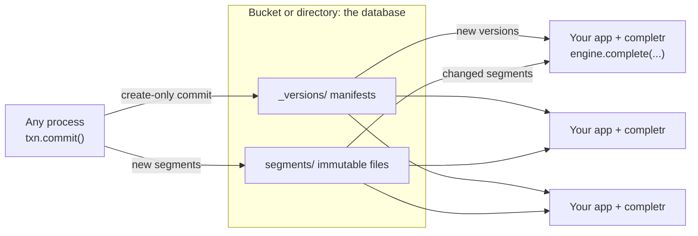

<p align="center">
  <picture>
    <source media="(prefers-color-scheme: dark)" srcset="assets/banner-dark.svg">
    
  </picture>
</p>

<p align="center">
  An embedded autocompletion engine whose database is a bucket. No servers to run.<br>
  Exact, prefix, infix, abbreviation, spelling-tolerant, word-decomposing and semantic completions,<br>
  ranked by popularity and served in well under a millisecond.
</p>

<p align="center">
  <a href="#quick-start">Quick start</a> ·
  <a href="https://completr.pages.dev/">Docs</a> ·
  <a href="https://docs.rs/completr">Rust docs</a> ·
  <a href="https://completr.pages.dev/reference/python/">Python API</a> ·
  <a href="docs/architecture.md">Architecture</a> ·
  <a href="#benchmarks">Benchmarks</a> ·
  <a href="CHANGELOG.md">Changelog</a>
</p>

<p align="center">
  <a href="https://github.com/sayef/completr/actions/workflows/ci.yml"></a>
  <a href="https://crates.io/crates/completr"></a>
  <a href="https://docs.rs/completr"></a>
  <a href="https://pypi.org/project/completr/"></a>
  
  <a href="LICENSE"></a>
</p>

<p align="center">
  
</p>

completr is a **serverless autocompletion engine**. In the spirit of [LanceDB](https://github.com/lancedb/lancedb),
it is a library, not a service: your application embeds it (Rust, or Python through first-class bindings),
and an object-store bucket or a local directory is the database. There is no cluster to deploy, scale,
upgrade or keep alive. Every process that serves completions reads the index straight from storage, and
writers coordinate through the storage itself.

You give it documents (an id, a text, a popularity weight, and optionally aliases and an embedding), and it
completes what your users type: every kind of match an autocomplete box needs, ranked together, and kept
fresh while your data changes.

## Contents

- [Serverless by design](#serverless-by-design)
- [Features](#features)
- [What it completes](#what-it-completes)
- [Installation](#installation)
- [Quick start](#quick-start)
- [Guides](#guides): [documents](#documents), [filtering](#filtering-by-context), [synonyms](#synonyms), [layers](#layers), [semantic and hybrid](#semantic-and-hybrid-completion), [databases](#databases-on-disk-and-in-buckets), [asyncio](#asyncio), [collections](#collections), [command line](#command-line), [configuration](#configuration)
- [Benchmarks](#benchmarks)
- [Guarantees and testing](#guarantees-and-testing)
- [Non-features](#non-features)
- [FAQ](#faq)
- [Contributing](#contributing) · [License](#license)

## Serverless by design



- **Storage is the only shared component.** Manifests and segments are plain objects on S3, GCS, Azure or
  a file system. Nothing else runs between your processes.
- **Commits are create-only writes.** Version `N + 1` is written with `If-None-Match` (exclusive create on a
  file system), so concurrent writers never corrupt each other; a loser retries on the newer version.
- **Readers scale with your application.** Each engine syncs itself in the background, loads only changed,
  immutable segments (memory-mapped from local disk or the optional disk cache) and switches versions
  atomically. Add capacity by adding replicas of your own app.
- **Queries never leave the process**, so there is no network hop on the hot path.

## Features

**Matching**
- **Exact and prefix completion** as users type, over whole titles and their words.
- **Infix matching**: `queen` finds *Dancing Queen – ABBA*.
- **Abbreviations**: `RHCP` completes *Under the Bridge – Red Hot Chili Peppers*. Abbreviations match exactly, so
  short codes do not flood the results.
- **Synonyms**: alternative names that are prefix-searchable and point back to their document, searched
  on their own so they never displace a direct match.
- **Spelling correction** of up to two edits per word, SymSpell-style, verified with
  [rapidfuzz](https://github.com/rapidfuzz/rapidfuzz-rs): `bohemain rapsody` finds *Bohemian Rhapsody – Queen*.
- **Word decomposition**: run-together input such as `dancingqueen` is split into words and completed.
- **Semantic completion** from embeddings of any model, quantised to 2-4 bits.
- **Hybrid completion** with reciprocal rank fusion, weighted blending or lexical-first ordering, chosen per
  request.
- **Context filters**: restrict any request to documents tagged with a category, tenant or language.
- **Your own ids**: integers or strings such as UUIDs, returned with every suggestion as given. Documents
  with the same title stay separate results.

**Ranking**
- **Popularity** through a per-document weight, combined with match kind, text length and whole-word
  bonuses.
- Every suggestion carries its **text, match kind and highlight ranges**, so your UI renders it directly.
- **Deterministic**: identical inputs give bit-identical scores and order, with ties broken by id.

**Serving**
- **Fast**: p50 around 0.1 ms and p99 under 3 ms for typed queries on 200k documents, on one core.
- **Zero-copy segments**: an aligned, checksummed binary format read in place through `mmap`. Opening a
  segment takes under a millisecond and reads only its headers. Texts are FSST-compressed and decoded one
  at a time.
- **Compact index**: titles are found through documents sorted by title, words by binary search over
  their sorted texts, spelling variants through Elias-Fano coded buckets, and postings are delta coded in
  blocks, so the 7.2 million English Wikipedia titles index into 338 MB, less than tantivy's 357 MB.
- **Streaming builds**: documents stream into a `SegmentBuilder` (`completr.Segment.build(rows, path=...)`
  in Python), which keeps them compactly and writes each section to the file as it is produced. Indexing
  the 124,440 HN titles takes 0.29 s and peaks at 59 MB.
- **Bounded indexing memory**: a `SegmentWriter` starts a new segment file whenever building the current
  one would pass its memory budget (256 MB by default), so any corpus indexes in bounded memory. The
  segments rank exactly like one, and compaction merges them through their sorted dictionaries, byte for
  byte as a rebuild would: all of English Wikipedia, 7.2 million titles, is written and compacted into one
  segment in 25.6 s, and 40 million MusicBrainz recordings in 317 s with a peak of 547 MB.
- **Override layers**: search a tenant's, a user's or an experiment's index on top of shared data, per
  document id, without copying it.
- A **short-query cache** for one- to three-character prefixes, carried across index versions.

**Serverless updates**
- **Immutable segments**, as in Lucene and LanceDB: updates land as small delta segments, and tiered
  compaction merges them.
- **Versioned databases** on local disk, S3, GCS, Azure or memory, with optimistic, create-only commits and
  automatic retries.
- **Engines that follow the database**: an engine from `db.engine()` loads new versions in a background
  thread, with no sync loop to write.
- **One ingestor, many writers**, when you need it: any process submits change sets, and a lease-elected
  `Ingestor` commits them in order.
- **Credentials like `boto3`**: environment, profiles, SSO, web identity, ECS and IMDS.

**Developer experience**
- Documents as dicts, `completr.Document` objects, or pandas, polars and Arrow tables, with int or string ids.
- Indexes, engines, databases and transactions at the top level of `completr`, an asyncio API, typed stubs
  and a clear exception hierarchy.
- [Collections](https://completr.pages.dev/guides/collections/) on top, for named collections that compact
  themselves.
- A `completr` command-line tool, and `tracing` events that also reach Python's `logging`.

## What it completes

Real results from the index behind the demo above (23 short titles with popularity weights):

| Query | Top completion | Kind | Capability |
|---|---|---|---|
| `danc` | Dancing Queen – ABBA, Dancing in the Dark – Bruce Springsteen, Dancing On My Own – Robyn | `prefix` | completion by popularity |
| `rhcp` | Under the Bridge – Red Hot Chili Peppers | `abbreviation` | abbreviations, case-insensitive |
| `bohemain rapsody` | Bohemian Rhapsody – Queen | `fuzzy` | spelling correction, two words |
| `dancingqueen` | Dancing Queen – ABBA | `prefix` | word decomposition |
| `queen` | Bohemian Rhapsody – Queen, Dancing Queen – ABBA, Killer Queen – Queen | `infix` | matches inside titles |
| `is this the real` | Bohemian Rhapsody – Queen | `synonym` | synonyms, through `complete_aliases` |

## Installation

```sh
pip install completr
```

```sh
cargo add completr --features store                       # databases on local disk and in memory
cargo add completr --features aws-credentials,gcp,azure   # plus S3, GCS and Azure
cargo add tokio --features macros,rt-multi-thread         # the database API is async
```

| Cargo feature | Adds |
|---|---|
| none | The engine: `Segment`, `SegmentWriter`, `Index`, `Engine` |
| `store` | `Database`, `Transaction`, `Replica`, `Lease`, `ChangeSet`, `Ingestor`, local and in-memory stores, and collections: `connect`, `Client`, `Collection` |
| `aws` / `gcp` / `azure` | S3, Google Cloud Storage, Azure Blob Storage |
| `aws-credentials` | S3 credentials through the AWS SDK chain |

The Python wheel includes all features. It is abi3 for CPython 3.11+, and releases the GIL while it
searches and builds.

## Quick start

### Python

```python
import completr
from completr import Index

docs = [   # also completr.Document objects, pandas, polars or Arrow tables
    {"id": "bohemian", "text": "Bohemian Rhapsody – Queen", "popularity": 0.95, "synonyms": ["is this the real life"]},
    {"id": "dancing", "text": "Dancing Queen – ABBA", "popularity": 0.85},
    {"id": "dark", "text": "Dancing in the Dark – Bruce Springsteen", "popularity": 0.7},
    {"id": "bridge", "text": "Under the Bridge – Red Hot Chili Peppers", "popularity": 0.75, "abbreviations": ["RHCP"]},
]
index = Index.from_documents(docs)   # in memory

for query in ["danc", "RHCP", "bohemain rapsody", "queen"]:
    print(query, [(s.text, s.kind, round(s.score, 3)) for s in index.complete(query, limit=3)])
```

```text
danc [('Dancing Queen – ABBA', 'prefix', 0.547), ('Dancing in the Dark – Bruce Springsteen', 'prefix', 0.462)]
RHCP [('Under the Bridge – Red Hot Chili Peppers', 'abbreviation', 0.486)]
bohemain rapsody [('Bohemian Rhapsody – Queen', 'fuzzy', 0.186)]
queen [('Bohemian Rhapsody – Queen', 'infix', 0.356), ('Dancing Queen – ABBA', 'infix', 0.329)]
```

Each suggestion carries its `id` (an int or the string you gave), `text`, `score`, `kind`, `layer` (the
index it came from, in a layered search), and `highlights`: character ranges of the text that matched,
ready to render in bold.

```python
top = index.complete("danc")[0]
[top.text[a:b] for a, b in top.highlights]   # ['Danc']
```

A database keeps named indexes in a directory or bucket. A transaction commits a new version, and an
engine from the database serves it, loading newer versions by itself every `sync_every` seconds (5 by
default):

```python
db = completr.connect("./data")   # or "s3://bucket/prefix", "gs://...", "az://...", "memory://"
txn = db.begin()
txn.append("songs", docs)   # upserts; deletes=[...] removes ids
txn.commit()

engine = db.engine()
engine.complete("danc", ["songs"])   # [Suggestion(id='dancing', ...), Suggestion(id='dark', ...)]
```

Other processes that open the same database and take an engine see the commit within `sync_every`
seconds; `engine.sync()` loads it at once.

### Rust

```rust
use std::{sync::Arc, time::Duration};
use completr::{Database, Document, Engine, Index, IndexOptions, Replica};

let docs = || [
    Document::keyed("bohemian", "Bohemian Rhapsody – Queen", 0.95).with_synonym("is this the real life"),
    Document::keyed("dancing", "Dancing Queen – ABBA", 0.85),
    Document::keyed("dark", "Dancing in the Dark – Bruce Springsteen", 0.7),
    Document::keyed("bridge", "Under the Bridge – Red Hot Chili Peppers", 0.75).with_abbreviation("RHCP"),
];
let index = Index::from_documents(docs())?;
for s in index.complete("danc", 10) {
    println!("{} {} {:.3} {:?}", s.text, s.kind.as_str(), s.score, s.highlights);
}

let database = Database::open("./data", Vec::<(String, String)>::new()).await?;
let mut txn = database.begin().await?;
txn.append_documents("songs", docs(), [])?;
txn.commit().await?;

let engine = Arc::new(Engine::new());
let replica = Arc::new(Replica::new(database, IndexOptions::default()));
replica.sync(&engine).await?;
let _follower = replica.follow(&engine, Duration::from_secs(5));   // syncs until dropped
let hits = engine.complete(&["songs"], "danc", 10);
```

Runnable versions: [`quickstart.rs`](crates/completr/examples/quickstart.rs) and
[`quickstart.py`](crates/completr-py/examples/quickstart.py).

## Guides

### Documents

| Field | Type | Meaning |
|---|---|---|
| `id` | `int` or `str` | Your identifier. String ids are hashed to a stable 64-bit id and returned as given. |
| `text` | `str` | What is completed and displayed. |
| `popularity` | `float` | Usually in `[0, 1]`; more popular documents rank higher. |
| `synonyms` | `list[str]` | Alternative names, matched by `complete_aliases`. |
| `abbreviations` | `list[str]` | Codes such as `RHCP`, matched exactly by `complete`. |
| `contexts` | `list[str]` | Tags that requests can filter on, e.g. a genre or tenant. |
| `vector` | float array | Optional embedding; or pass `vectors=` for all documents at once. |

Unknown fields raise `InvalidInputError`, so a typo never silently drops data.

### Filtering by context

Tag documents with `contexts` and restrict any request to them. Filtering happens while candidates are
collected, so a filtered request still returns up to `limit` results.

```python
index = completr.Index.from_documents([
    {"id": "dancing", "text": "Dancing Queen – ABBA", "popularity": 0.85, "contexts": ["pop", "disco"]},
    {"id": "dark", "text": "Dancing in the Dark – Bruce Springsteen", "popularity": 0.7, "contexts": ["rock"]},
    {"id": "ownown", "text": "Dancing On My Own – Robyn", "popularity": 0.5, "contexts": ["pop"]},
])
[s.text for s in index.complete("danc", contexts=["pop"])]
# ['Dancing Queen – ABBA', 'Dancing On My Own – Robyn']
[s.text for s in index.complete("danc", contexts=["disco", "rock"])]   # any of the contexts
# ['Dancing Queen – ABBA', 'Dancing in the Dark – Bruce Springsteen']
```

`engine.complete(...)` and `hybrid_search(...)` take the same `contexts`.

### Synonyms

Synonyms are searched with `complete_aliases`, apart from direct matches, so an alternative name never
displaces what the user typed. Suggestions carry the document's text:

```python
index.complete_aliases("is this the real")   # [AliasSuggestion(id='bohemian', text="Bohemian Rhapsody – Queen", ...)]
```

### Layers

An engine searches a list of indexes, its layers. Later layers override earlier ones per document id, so a
tenant's edits, deletions and additions shadow the shared data.

```python
txn = db.begin()
txn.append("radio", [{"id": "bohemian", "text": "Bohemian Rhapsody (Remastered 2011) – Queen"}], deletes=["dark"])   # a station's overrides
txn.commit()
engine.sync()

engine.complete("queen", ["songs", "radio"])   # suggestion.layer tells which index it came from
```

`completr.Engine()` with `engine.publish({"shared": index, ...})` does the same with indexes in memory.

### Semantic and hybrid completion

Documents can carry embeddings from any model. completr quantises them with
[TurboQuant](https://crates.io/crates/turbovec) (4 bits by default, 2 or 3 optional) and searches them with
deleted and filtered-out documents masked out.

```python
vectors = embed([d["text"] for d in docs]).astype("float32")   # shape (n, dim)
index = Index.from_documents(docs, vectors=vectors)              # or txn.append(..., vectors=vectors)

index.hybrid_search("dancing q", embed(["dancing q"])[0])                       # fused by reciprocal rank
index.hybrid_search("dancing q", embed(["dancing q"])[0], fusion="weighted")    # or "lexical_first"
index.vector_search(embed(["disco classics"])[0])                               # kind == "semantic"
```

| Fusion | Score |
|---|---|
| `rrf` (default) | `1 / (k + lexical_rank) + 1 / (k + semantic_rank)`, `k = 60`, no calibration needed |
| `weighted` | `(1 - w) * lexical + w * max(semantic, 0)`, set `semantic_weight` |
| `lexical_first` | lexical hits in their order, then semantic-only hits |

A hybrid suggestion keeps its lexical match kind when it matched lexically, and is `semantic` otherwise.
It also reports both source scores.

### Databases on disk and in buckets

`completr.connect(url)` opens a versioned database in a directory or bucket, and creates a local one if it
does not exist. Commits go straight to storage, durable on return; concurrent writers retry on the newer
version. Engines sync themselves in a background thread.

```python
import completr

# Any process that writes:
db = completr.connect("s3://my-bucket/completions")   # or a local path, gs://..., az://...
txn = db.begin()
txn.append("songs", [{"id": f"s{i}", "text": f"song {i}"} for i in range(10_000)], deletes=["s42"])
txn.commit()

# Every serving process: the engine picks up new versions every sync_every seconds.
engine = completr.connect("s3://my-bucket/completions", cache_dir="/var/cache/completr").engine(sync_every=5.0)
engine.complete("danc", ["songs"])
```

Runnable: [`live_updates.py`](crates/completr-py/examples/live_updates.py).

- **Status**: `engine.version` is the version served, and `engine.sync_status` the last background sync's
  `synced_at` and `error`.
- **Compaction**: `db.compact("songs")` merges small segments tier by tier; an ingestor does it for
  you.
- **Cleanup**: `db.cleanup(keep_versions=10, older_than_seconds=3600)` deletes old manifests, and segment
  files that no retained version references.
- **Many writers**: `db.submit(changes)` queues a `ChangeSet`, and a lease-elected `Ingestor` commits
  queued change sets in order.
- **Forking servers**: open databases and engines in each worker after a pre-forking server forks.
- **Credentials**: S3 uses the standard AWS chain. Override it with
  `options={"aws_access_key_id": ..., "aws_region": ...}`, and pass `cache_dir=...` to keep downloaded
  segments on local disk.

### asyncio

`completr.AsyncDatabase` has the same methods as a database, awaited, for FastAPI and other asyncio
services. Constructing it does not block; storage opens on the first awaited call. Completions stay
synchronous: they take well under a millisecond.

```python
db = completr.AsyncDatabase("s3://my-bucket/completions")
txn = await db.begin()
txn.append("songs", [{"id": "billie", "text": "Billie Jean – Michael Jackson", "popularity": 0.9}])
await db.commit(txn)
engine = await db.engine()
engine.complete("bill", ["songs"])
```

See the [FastAPI example](examples/fastapi).

### Collections

`completr.Client` is a convenience layer on top: named collections with stored settings, that compact
themselves after writes, report `stats()`, and complete synonyms below direct matches in one call. Each
collection is an index of the same name.

```python
client = completr.Client("./data")
songs = client.get_or_create_collection("songs")
songs.add([{"id": "bohemian", "text": "Bohemian Rhapsody – Queen", "popularity": 0.95, "synonyms": ["is this the real life"]}])
songs.complete("is this the real", aliases=True)   # [Suggestion(id='bohemian', ..., kind="synonym")]
```

It does not expose index options, the choice of fusion, or getting documents by id; `client.database`
returns the database underneath. In Rust, `completr::connect` returns this client. See
[Collections](https://completr.pages.dev/guides/collections/).

### Command line

The `completr` tool operates a database from a terminal or a cron job. Every command takes the database URL
first (or `COMPLETR_URL`).

```sh
cargo install completr-cli

completr s3://my-bucket/completions import songs songs.jsonl   # JSON Lines documents
completr s3://my-bucket/completions complete songs "danc" --contexts pop
completr s3://my-bucket/completions inspect                    # versions, indexes, sizes
completr s3://my-bucket/completions compact songs
completr s3://my-bucket/completions cleanup --keep-versions 10
completr s3://my-bucket/completions ingest --interval 1         # run an ingestor
```

Engine events are logged to stderr; set `COMPLETR_LOG=completr=debug` for more.

### Errors

Every error derives from `completr.CompletrError`: `ConflictError`, `CorruptionError`, `NotFoundError`,
`InvalidInputError` (also a `ValueError`) and `StorageError` (also an `OSError`).

### Configuration

| Where | Settings |
|---|---|
| `connect(...)` | `options`, `cache_dir`, and the build options `min_word_chars`, `max_edit_distance`, `fuzzy_prefix_chars`, `vector_bits`, `compact_keys`, `build_threads` |
| `db.engine(...)` | `sync_every`, `group_separator`, `overfetch`, and the index options `popularity_weight`, `short_query_chars`, `short_query_limit`, `short_query_cache_entries`, `vector_threads` |
| `complete(...)`, `hybrid_search(...)` | `limit`, `contexts`; `fusion`, `rrf_k`, `semantic_weight`, `candidates` |
| `db.compact(...)`, `db.cleanup(...)`, `Ingestor(...)` | `fanout`, `max_segments`, `max_hidden_fraction`; `keep_versions`, `older_than_seconds`; `lease_ttl_seconds`, `max_change_sets` |

In Rust, `BuildOptions`, `IndexOptions`, `SearchOptions`, `HybridOptions`, `CompactionPolicy` and
`CleanupPolicy` expose the same settings through chainable setters, e.g.
`SearchOptions::new(5).contexts(["pop"])`. The
[configuration guide](https://completr.pages.dev/guides/configuration/) lists every setting, including the
collections layer's.

## Benchmarks

**Against other engines.** On five corpora, from 124,440 Hacker News titles to all 40 million MusicBrainz
recordings, 39.6 million Amazon search terms and 41.7 million Open Library works, typed character by
character, completr ranks the wanted title best of tantivy, Typesense and Meilisearch in 19 of 20
comparisons (popular and uniformly drawn targets, typed cleanly and with a typo). On 20,000 prefixes Amazon's
users really typed, it has the searched term in its top 10 for 28.5% of them, against 25.2% for Meilisearch
and 23.8% for tantivy. In process it answers 40 million MusicBrainz recordings in 1.5 to 3.0 ms at the
median, with every p99 below every other engine's, and serves 1,355 queries per second on 8 threads, 14
times tantivy. Its index is the smallest on every corpus above HN (MusicBrainz: 3.1 GB, against 5.9 GB for
tantivy and 39.5 GB for Meilisearch). tantivy still indexes the two largest corpora faster. Full tables, a
capability comparison, where the bytes go, settings and caveats are in
[docs/benchmarks.md](docs/benchmarks.md); the harness is in [`bench/`](bench/).

**On a synthetic corpus.**

A synthetic corpus of 200,000 documents (1 to 4 words from a 30,000-word vocabulary, Zipf-distributed), on
one core of an Apple M1 Pro. Reproduce with
`cargo run --release -p completr --example bench -- 200000 --vectors`.

| Step | Result |
|---|---|
| Build a segment | 188 ms, 5.6 MB |
| Open a segment (memory-mapped) | 0.2 ms |
| Build a delta segment of 1,000 upserts | 3.7 ms |

| Query, limit 10 | p50 | p99 |
|---|---|---|
| Every prefix of 2,000 titles, as typed (33,744 queries) | 0.08 ms | 2.6 ms |
| The same, with the short-query cache (default) | 0.05 ms | 0.51 ms |
| The same, over a base plus a delta segment | 0.12 ms | 3.4 ms |
| One-edit typos | 0.21 ms | 1.1 ms |
| Vector search, 256-d, 4-bit | 1.1 ms | 1.2 ms |
| Hybrid search (RRF) | 1.3 ms | 3.7 ms |

The vector rows come from the same run with `--vectors`, whose segment is 32.8 MB.

One- and two-character prefixes, which match large parts of the corpus, dominate the tail. The short-query
cache serves them, and replicas carry its hottest entries across index versions.

## Guarantees and testing

- **Determinism**: results depend only on the documents and settings, not on how the index was segmented,
  compacted or queried concurrently. The tests re-run queries sampled under concurrent updates, on the same
  snapshot and on a freshly built index, and require bit-identical output.
- **Concurrency**: readers never block. New index versions are published atomically, and a reader keeps
  the version it started with.
- **Integrity**: every segment ends with an xxh3 checksum. `Segment::open` checks a local file's structure
  only; `Segment::verify`, `Segment::from_bytes` and downloads into a store's cache check the checksum and
  every section. Stable-Rust fuzz tests feed in truncated, bit-flipped and garbage segments, random Unicode
  queries and corrupted manifests.
- **Memory**: replicas replace indexes group by group, and release old segments before loading the next
  group. In a soak test over thousands of versions, serving memory stayed flat.

```sh
cargo test --release -p completr --features store          # unit, database, concurrency and fuzz tests
COMPLETR_FUZZ_ITERS=1000000 cargo test --release -p completr --features store --test fuzz
```

## Non-features

completr does one job. It deliberately does not include:
- a server or HTTP API; it is serverless by design, so expose it through your own API if you need one;
- full-text search over long documents, filtering or faceting;
- multi-field schemas; each document has one text, plus aliases and an optional embedding;
- built-in embedding models; bring vectors from any model;
- sharding across machines; one index is expected to fit on one machine, memory-mapped.

## FAQ

**What does "serverless" mean here?**
The same as for LanceDB: there is no completr server. The engine is a library in your process, and the
database is a set of files in a bucket or directory. Your application is still deployed however you like,
on containers, VMs or functions; completr adds no extra service to it.

**How does completr differ from Elasticsearch, OpenSearch, Typesense or Meilisearch?**
Those are search servers for documents with many fields, filters and facets: you run and scale a cluster,
and every query crosses the network. completr is serverless and does autocompletion only: it runs inside
your process, and ranks the match kinds a completion box needs (abbreviations, spelling correction, word
decomposition) together with popularity. Many applications use both: a search server for the results page,
completr for the box.

**How do several writers avoid conflicts without a server?**
Through the store. Commits create the next manifest create-only, so exactly one writer wins each version
and the others rebase and retry. For high write rates, processes can instead submit change sets to an
inbox, and a single `Ingestor` elected by an expiring lease commits them in order. Every commit carries
the lease generation as a fencing token, so an ingestor that lost its lease cannot commit.

**How does it differ from an FST or trie library?**
[`fst`](https://crates.io/crates/fst) and [marisa-trie](https://github.com/s-yata/marisa-trie) are
excellent key dictionaries, and completr uses the same ideas internally. On top of them it adds scoring,
typo tolerance, abbreviations, semantic search, updates without rebuilding, and storage.

**Which languages does it support?**
Text is normalised with Unicode lowercasing and split on Unicode whitespace, so any language written with
spaces works as it is. For scripts written without spaces, such as Chinese and Japanese, pass text
segmented into words to get infix matching.

**How large can an index be?**
A segment is memory-mapped and costs roughly 100 bytes per short title, plus about 136 bytes per 256-d
vector at 4 bits. Hundreds of thousands to a few million documents per index fit comfortably on one
machine.

**Why the name?**
*completr* is said "completer": it completes what people type, and the missing vowel is a nod to
search-engine names such as Solr. Its wordmark shows the name being completed as you type it.

## How it works

A segment stores its documents in zstd-compressed blocks, and its keys in three dictionaries: titles,
title words and aliases. SymSpell delete variants for spelling correction are hashed into buckets of word
ordinals. Popularity and title length are kept in aligned columns, and postings are bit-packed. Queries run on primitives merged across segments
(cursor merges over the sorted dictionaries), so an index of many segments ranks exactly like a single
one. See [docs/architecture.md](docs/architecture.md) for the format, the ranking and the database
protocol.

## Status

completr is young. The on-disk format is versioned and checked on load, but it and the API may still change
before 1.0. Feedback and issues are very welcome.

## Contributing

Contributions are welcome. Please read [CONTRIBUTING.md](CONTRIBUTING.md) and the
[Code of Conduct](CODE_OF_CONDUCT.md). To report a vulnerability, see [SECURITY.md](SECURITY.md).

## Acknowledgements

completr builds on excellent work: [`fst`](https://github.com/BurntSushi/fst) by Andrew Gallant,
[`rapidfuzz`](https://github.com/rapidfuzz/rapidfuzz-rs), [`turbovec`](https://crates.io/crates/turbovec),
[`object_store`](https://github.com/apache/arrow-rs-object-store), [`zstd`](https://github.com/gyscos/zstd-rs)
and [PyO3](https://github.com/PyO3/pyo3). Its trie design is inspired by
[marisa-trie](https://github.com/s-yata/marisa-trie), its spelling correction and word decomposition by
[SymSpell](https://github.com/wolfgarbe/SymSpell), and its database protocol by
[Lance](https://github.com/lancedb/lance). The wordmark and demo use outlines of [Space Grotesk](https://github.com/floriankarsten/space-grotesk) and
[Source Sans 3](https://github.com/adobe-fonts/source-sans).

## License

[MIT](LICENSE). Developed and maintained by [Saiful Islam](https://github.com/sayef).
