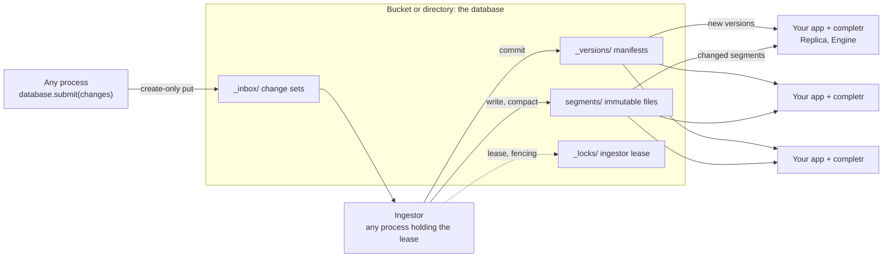

# Concepts

completr has a small model: documents are built into immutable segments, segments form indexes, engines
serve indexes by name, and a database stores versions of them in a bucket or directory. This page
introduces each part. [Architecture](architecture.md) has the full detail.

## Serverless by design

- **Storage is the only shared component.** Manifests, segments, the change-set inbox and the ingestor
  lease are plain objects on S3, GCS, Azure or a file system. Nothing else runs between your processes.
- **Commits are create-only writes.** Version `N + 1` is written with `If-None-Match` (exclusive create on
  a file system), so concurrent writers never corrupt each other; a loser rebases or retries.
- **Ingestion is a role, not a service.** Any process may run an `Ingestor`; the one holding an expiring,
  fenced lease commits the inbox, and another takes over when it stops.
- **Readers scale with your application.** Each serving process runs a `Replica` that loads only changed,
  immutable segments and switches versions atomically.
- **Queries never leave the process**, so there is no network hop on the hot path.

## Documents

A document is what users complete to: an id, one text, a popularity weight, and optionally synonyms,
abbreviations, context tags and an embedding. Ids are integers or strings; a string id is hashed to a
stable 64-bit id (`completr.key_id`) and returned as given. See [Documents](guides/documents.md).

## Segments

A `Segment` is an immutable, self-contained set of documents plus the ids it deletes from older segments.
It is one file, 8-byte aligned and checksummed, and it is read in place through a memory map, so opening
one costs validation, not parsing. Segments are never modified: updates are new, small segments.

## Indexes

An `Index` is a list of segments ordered oldest to newest. A newer copy of an id supersedes older ones, and
a segment's deletes hide ids in older segments. Candidates are merged across segments below scoring, so an
index of many segments ranks exactly like one compacted segment.

## Engines and layers

An `Engine` holds indexes by name and replaces them atomically: a search in progress keeps the version it
started with. A search names a list of **layers**; later layers override earlier ones per document id.
This lets a tenant's or a user's index shadow shared data without copying it. See
[Layers](guides/layers.md).

The library has no notion of tenants, languages or domains. You express those as index names, for example
`acme/en`, and as layer lists.

## Databases

A `Database` is a prefix in an object store, or a local directory, holding versioned **manifests** that map
index names to segment files. `completr.connect(url)` opens one. Transactions commit atomically by writing
the next manifest create-only; a commit that loses a race rebases, or fails with `ConflictError` in strict
mode. Old versions and unreferenced segments are removed by `cleanup`.

## Change sets, the ingestor and replicas

Many processes committing directly would contend on the manifest. Instead:

| Part | Role |
|---|---|
| `ChangeSet` | Upserts and deletes for one or more indexes, applied together. Any process submits one with `db.submit(changes)`, which writes it to the inbox. |
| `Ingestor` | Commits pending change sets in submission order, then compacts the indexes it touched. Every process may run one; only the holder of the `ingestor` lease acts, and its commits are fenced by the lease generation. |
| `Replica` | Follows the database for a serving process: lists only newer manifests, downloads only new segments, rebuilds only changed indexes, and publishes them to an `Engine`. In Python, `db.engine()` returns an engine with its replica built in. |

## Match kinds

| Kind | Example query | Matches |
|---|---|---|
| `exact` | `machine learning` | The whole text, after lowercasing. Run-together input such as `datascience` is decomposed into words and can match exactly. |
| `prefix` | `mach` | The start of the text, word by word as users type. |
| `abbreviation` | `ML` | An abbreviation alias, exactly and case-insensitively. |
| `infix` | `science` | A word inside the text (*Data Science*). |
| `fuzzy` | `machne lerning` | Up to two edits per word (*Machine Learning*). |
| `semantic` | an embedding | The nearest documents by vector, from `vector_search` or `hybrid_search`. |

Synonyms are searched with `complete_aliases`, which returns `AliasSuggestion`s. See
[Completion](guides/completion.md).

## Scoring overview

Scores are deterministic: identical inputs give bit-identical scores and order.

1. A **base score** by match kind: exact 150, prefix 90, infix 30, and fuzzy
   `20 * 0.15^(distance - 1)` plus a rank bonus.
2. A **length penalty** of 0.1 per character, and a bonus of 25 when a single-word query matches a whole
   word of a multi-word title.
3. A **popularity multiplier**, `1 + popularity * popularity_weight * 10`, with `popularity_weight` 0.4 by
   default.
4. **Normalisation** by the index's `max_score`, after which fuzzy hits are rescaled to rank below the
   weakest direct match.
5. **Order** by score, then shorter text, then id.

A database estimates `max_score` when an index is created and keeps it for later appends, so scores stay
comparable as the index changes. Pin it with `Transaction.set_max_score` or `max_score=` when they must stay
comparable across rebuilds.
