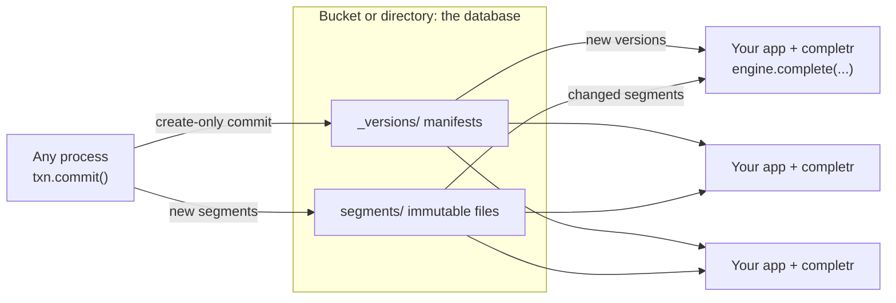

# Concepts

completr has a small model: documents go into immutable segments, segments make up an index, an engine
serves indexes by name, and a database keeps versions of named indexes in storage. This page introduces
each part. [Architecture](architecture.md) has the full detail.

## Serverless by design

- **Storage is the only shared component.** Manifests and segments are plain objects on S3, GCS, Azure or
  a file system. Nothing else runs between your processes.
- **Commits are create-only writes.** Version `N + 1` is written with `If-None-Match` (exclusive create on
  a file system), so concurrent writers never corrupt each other; a loser retries on the newer version.
- **Readers scale with your application.** Each engine loads only changed, immutable segments and
  switches versions atomically.
- **Queries never leave the process**, so there is no network hop on the hot path.

## Documents

A document is what users complete to: an id, one text, a popularity weight, and optionally synonyms,
abbreviations, context tags and an embedding. Ids are integers or strings; a string id is hashed to a
stable 64-bit id (`completr.key_id`) and returned as given. A newer document with the same id replaces the
older one. See [Documents](guides/documents.md).

## Segments and indexes

A **segment** is an immutable, checksummed file of documents, plus the ids it deletes from older segments.
It is read in place through a memory map. An **index** is a list of segments, oldest to newest, searched
as one: a newer copy of an id supersedes older ones, and an index of many segments ranks exactly like one
compacted segment, because candidates are merged across segments below scoring.

`Index.from_documents` builds a one-segment index in memory. `Segment.build` and `SegmentWriter` build
segment files, the latter in bounded memory.

## Engines and layers

An **engine** holds indexes by name in **namespaces**, and switches each namespace to a new version in one
step. A search names a list of a namespace's indexes, its **layers**. Later layers override earlier ones per document id, so a tenant's edits, deletions and
additions shadow shared data without copying it. Each suggestion names the index it came from. See
[Layers](guides/layers.md).

The library has no notion of tenants, languages or domains. You express those as namespaces, such as one per
locale, index names, such as one per tenant, and layer lists. A layer that does not exist raises
`LayerNotFoundError` unless the search passes `ignore_missing_layers=True`.

## Databases and versions

A **database** is a directory or a bucket prefix. `completr.connect(url)` opens one. Every commit writes a
new **version**: a manifest that maps index names to segment files.

- **Transactions** change one or more indexes and commit them atomically. Writes never modify a segment;
  they add a small one. A commit that loses a race to another writer retries on top of the newer version.
- **Sync** loads the latest version into an engine: only manifests newer than its version, and only
  segments it does not hold. An engine from `db.engine()` syncs itself in a background thread. A search in
  progress keeps the version it started with.
- **Compaction** merges small segments into larger ones, so an index stays fast after many writes.
- **Cleanup** removes old versions and segments no retained version uses.

Compaction and cleanup run only when you call them, or, for compaction, when an
[ingestor](guides/writers.md) or a [collection](guides/collections.md) does it for you. See
[Serverless deployment](guides/serverless.md).

## Match kinds

| Kind | Example query | Matches |
|---|---|---|
| `exact` | `killer queen – queen` | The whole text, after lowercasing. Run-together input such as `dancingqueen` is decomposed into words first. |
| `prefix` | `danc` | The start of the text, word by word as users type. |
| `abbreviation` | `RHCP` | An abbreviation alias, exactly and case-insensitively. |
| `infix` | `queen` | A word inside the text (*Dancing Queen – ABBA*). |
| `fuzzy` | `bohemain rapsody` | Up to two edits per word (*Bohemian Rhapsody – Queen*). |
| `synonym` | `is this the real` | A synonym of the document, through `complete_aliases`. |
| `semantic` | an embedding | The nearest documents by vector, through `vector_search` or `hybrid_search`. |

See [Completion](guides/completion.md).

## Scoring overview

Scores are deterministic: identical inputs give bit-identical scores and order.

1. A **base score** by match kind: exact 150, prefix 90, infix 30, and fuzzy
   `20 * 0.15^(distance - 1)` plus a rank bonus.
2. A **length penalty** of 0.1 per character, and a bonus of 25 when a single-word query matches a whole
   word of a multi-word title.
3. A **popularity multiplier**, `1 + popularity * popularity_weight * 10`, with `popularity_weight` 0.4 by
   default.
4. **Normalisation** by the index's `max_score`, after which fuzzy hits are rescaled to rank below the
   weakest direct match.
5. **Order** by score, then shorter text, then id.

A database estimates `max_score` when an index gets its first documents or is overwritten, and keeps it
for later appends, so scores stay comparable as the index changes.

## Collections

`completr.Client` adds a convenience layer on top: named **collections**, each an index of the same name,
with settings stored in the database, automatic compaction after writes, `stats()`, and one `complete()`
that also merges synonyms below direct matches. See [Collections](guides/collections.md).
