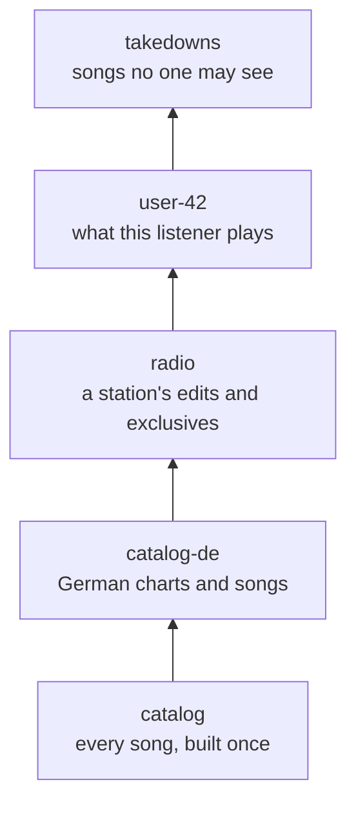

# Layers

Most completion systems give every audience its own copy of the index: one per customer, one per
language, one per experiment. Each copy is built, stored, kept in memory and updated on its own, so a fix
to one song's title means rebuilding all of them.

completr searches a **stack of indexes** instead. The bottom layer is the shared catalogue, built once.
Each layer above it holds only what differs for an audience: renamed songs, removed songs, extra songs,
different popularity. Later layers win per document id. A query names the stack it wants, so one engine
serves every tenant, language, user and experiment from one copy of the catalogue.



A layer is an ordinary index, so it is built, stored and synced like any other. A small layer is cheap:
building one of 50 songs takes under a millisecond, and a query over five layers of a 200,000-song
catalogue takes 0.2 ms at the median (see [Cost](#cost)).

## How a layered search works

A query passes its layers in order. Each layer is searched on its own, and the results are merged:

- **Edits**: a later layer that holds a document with the same id replaces the earlier version, even for
  queries only the earlier text matched.
- **Deletions**: a layer can delete ids it does not hold. They disappear from every earlier layer.
- **Additions**: documents only a later layer holds are completed alongside the rest.
- **One scale**: scores from every layer are put on the first layer's scale, so a song that a layer copies
  unchanged ranks exactly where it did, and raising its popularity raises it by as much as it would in the
  catalogue.

Each suggestion's `layer` names the index it came from. A layer that does not exist raises
`LayerNotFoundError`, naming the indexes that do; pass `ignore_missing_layers=True` when some audiences have
no layer of their own yet (see [Missing layers](#missing-layers)).

=== "Python"

    ```python
    import completr
    from completr import Engine, Index, Segment

    catalog = Index.from_documents([
        {"id": "bohemian", "text": "Bohemian Rhapsody – Queen", "popularity": 0.95},
        {"id": "killer", "text": "Killer Queen – Queen", "popularity": 0.6},
        {"id": "dancing", "text": "Dancing Queen – ABBA", "popularity": 0.85},
        {"id": "dark", "text": "Dancing in the Dark – Bruce Springsteen", "popularity": 0.7},
        {"id": "ownown", "text": "Dancing On My Own – Robyn", "popularity": 0.5},
        {"id": "problems", "text": "99 Problems – Jay-Z", "popularity": 0.8},
        {"id": "luftballons", "text": "99 Luftballons – Nena", "popularity": 0.3},
        {"id": "billie", "text": "Billie Jean – Michael Jackson", "popularity": 0.9},
    ])
    engine = Engine()
    engine.publish({"catalog": catalog})

    def show(query, layers):
        return [(s.text, s.layer) for s in engine.complete(query, layers, limit=4)]
    ```

=== "Rust"

    ```rust
    use std::sync::Arc;
    use completr::Engine;

    let engine = Engine::new();
    engine.publish([
        ("catalog".to_owned(), Some(Arc::new(catalog))),
        ("radio".to_owned(), Some(Arc::new(radio))),
    ]);
    for layered in engine.complete(&["catalog", "radio"], "queen", 10)? {
        println!("{} from layer {}", layered.suggestion.text, layered.layer);
    }
    ```

    In Rust, the engine returns `LayeredSuggestion`s whose `layer` is the position in the layer list.

The examples below build on this catalogue.

## Tenants

A radio station using the shared catalogue wants the remastered "Bohemian Rhapsody", its own live session
of "Dancing Queen", and no "Killer Queen". Its layer holds two songs and one deletion:

```python
radio = Index([Segment.build([
    {"id": "bohemian", "text": "Bohemian Rhapsody (Remastered 2011) – Queen", "popularity": 0.95},
    {"id": "session", "text": "Dancing Queen (Live Session) – ABBA", "popularity": 0.8},
], deletes=["killer"])])
engine.publish({"radio": radio})

show("queen", ["catalog"])
show("queen", ["catalog", "radio"])
```

```text
[('Bohemian Rhapsody – Queen', 'catalog'), ('Dancing Queen – ABBA', 'catalog'), ('Killer Queen – Queen', 'catalog')]
[('Bohemian Rhapsody (Remastered 2011) – Queen', 'radio'), ('Dancing Queen – ABBA', 'catalog'), ('Dancing Queen (Live Session) – ABBA', 'radio')]
```

Every other station keeps searching `["catalog"]`, or its own layer on top. A thousand stations cost one
catalogue plus a thousand small indexes, and a fix to the catalogue reaches all of them at once.

## Locales

What people search for differs by country. A German layer raises the songs that chart in Germany and adds
ones the global catalogue lacks:

```python
de = Index.from_documents([
    {"id": "luftballons", "text": "99 Luftballons – Nena", "popularity": 0.98},
    {"id": "atemlos", "text": "Atemlos durch die Nacht – Helene Fischer", "popularity": 0.9},
])
engine.publish({"catalog-de": de})

show("99", ["catalog"])
show("99", ["catalog", "catalog-de"])
show("atem", ["catalog", "catalog-de"])
```

```text
[('99 Problems – Jay-Z', 'catalog'), ('99 Luftballons – Nena', 'catalog')]
[('99 Luftballons – Nena', 'catalog-de'), ('99 Problems – Jay-Z', 'catalog')]
[('Atemlos durch die Nacht – Helene Fischer', 'catalog-de')]
```

The same layer can carry translated titles, local spellings and local abbreviations as synonyms and
abbreviations of the shared ids, without touching the catalogue.

## Personalisation

A user who plays "Dancing On My Own" every day should see it first. Their layer holds only the songs they
play, with popularity from their own history:

```python
user = Index.from_documents([{"id": "ownown", "text": "Dancing On My Own – Robyn", "popularity": 1.0}])
engine.publish({"user-42": user})

show("danc", ["catalog"])
show("danc", ["catalog", "user-42"])
```

```text
[('Dancing Queen – ABBA', 'catalog'), ('Dancing in the Dark – Bruce Springsteen', 'catalog'), ('Dancing On My Own – Robyn', 'catalog')]
[('Dancing On My Own – Robyn', 'user-42'), ('Dancing Queen – ABBA', 'catalog'), ('Dancing in the Dark – Bruce Springsteen', 'catalog')]
```

A layer of a few dozen songs builds in under a millisecond, so it can be built per request from recent
plays, or cached per user and published under the user's name.

## Promotions and takedowns

Editorial changes are layers too. A promotion raises a new release for a campaign; a takedown hides songs
that may not be shown, for licensing or legal reasons, in every query that includes it:

```python
promo = Index.from_documents([{"id": "dark", "text": "Dancing in the Dark – Bruce Springsteen", "popularity": 1.0}])
takedowns = Index([Segment.build([], deletes=["billie"])])
engine.publish({"promo": promo, "takedowns": takedowns})

show("danc", ["catalog", "promo"])
show("bill", ["catalog", "takedowns"])
```

```text
[('Dancing in the Dark – Bruce Springsteen', 'promo'), ('Dancing Queen – ABBA', 'catalog'), ('Dancing On My Own – Robyn', 'catalog')]
[]
```

Publishing a layer is atomic and takes effect on the next query: a takedown needs no rebuild of the
catalogue, and ending a campaign is `engine.publish({"promo": None})`.

## Experiments

An experiment is a layer that some users get. To test a different popularity signal, build it as a layer
over the same ids and add it to the stack of the users in the cohort:

```python
def layers_for(user_id, cohort):
    stack = ["catalog", "catalog-de", "radio"]
    if cohort == "b":
        stack.append("exp-popularity-v2")
    return stack + [f"user-{user_id}", "takedowns"]

engine.complete("danc", layers_for(7, "b"), ignore_missing_layers=True)
```

Both arms serve from the same catalogue, the experiment costs only the ids it changes, and ending it is
removing a name from a list. `ignore_missing_layers` lets listeners without a layer of their own use the same
code.

## Stacking them

The layers compose. One query can apply the German charts, a station's edits, a listener's history and the
takedowns, in that order:

```python
stack = ["catalog", "catalog-de", "radio", "user-42", "takedowns"]
show("queen", stack)
show("danc", stack)
show("99", stack)
```

```text
[('Bohemian Rhapsody (Remastered 2011) – Queen', 'radio'), ('Dancing Queen – ABBA', 'catalog'), ('Dancing Queen (Live Session) – ABBA', 'radio')]
[('Dancing On My Own – Robyn', 'user-42'), ('Dancing Queen – ABBA', 'catalog'), ('Dancing Queen (Live Session) – ABBA', 'radio'), ('Dancing in the Dark – Bruce Springsteen', 'catalog')]
[('99 Luftballons – Nena', 'catalog-de'), ('99 Problems – Jay-Z', 'catalog')]
```

Order matters: put the layers that must have the last word, such as takedowns, last. `complete_aliases`,
`vector_search` and `hybrid_search` take the same list of layers.

## Missing layers

A layer list often names layers that only some audiences have: most listeners have no `user-…` layer yet.
A missing layer is an error by default, so that a typo cannot silently drop a tenant's edits:

```python
show("danc", ["catalog", "user-7"])
```

```text
LayerNotFoundError: no index 'user-7' in namespace 'default' at version 5; indexes: catalog, catalog-de, promo, radio, takedowns, user-42; set ignore_missing_layers if it may not exist
```

The error carries `name`, `namespace`, `version` and `available`, and suggests a name when the missing one is
a likely typo of an existing one. When layers may legitimately be missing, say so:

```python
engine.complete("danc", ["catalog", "user-7"], ignore_missing_layers=True)
```

```text
[('Dancing Queen – ABBA', 'catalog'), ('Dancing in the Dark – Bruce Springsteen', 'catalog'), ('Dancing On My Own – Robyn', 'catalog')]
```

## Namespaces

Layers stack indexes within one **namespace**. A namespace is a named set of indexes that the engine switches
to a new version in one step: every search through it sees one consistent version of all its layers, and a
sync loads one namespace at a time, so memory never holds more than one namespace twice.

Use a namespace for each set of indexes that are searched together and never with another set: a locale with
its own catalogue and its own tenant layers, a market, an environment. Use layers within it for everything
that overrides by document id.

```python
db = completr.connect("./data")
with db.namespace("de").begin() as txn:
    txn.append("catalog", [
        {"id": "luftballons", "text": "99 Luftballons – Nena", "popularity": 0.98},
        {"id": "problems", "text": "99 Problems – Jay-Z", "popularity": 0.6},
    ])
    txn.append("radio", [{"id": "problems", "text": "99 Problems (Radio Edit) – Jay-Z", "popularity": 0.6}])
    txn.namespace("us").append("catalog", [
        {"id": "problems", "text": "99 Problems – Jay-Z", "popularity": 0.95},
        {"id": "luftballons", "text": "99 Red Balloons – Nena", "popularity": 0.4},
    ])

engine = db.engine()
de = engine.namespace("de")          # Namespace(name='de', version=1, indexes=['catalog', 'radio'])
de.complete("99", ["catalog", "radio"])
engine.namespace("us").complete("99", ["catalog", "radio"], ignore_missing_layers=True)
```

```text
[('99 Luftballons – Nena', 'catalog'), ('99 Problems (Radio Edit) – Jay-Z', 'radio')]
[('99 Problems – Jay-Z', 'catalog'), ('99 Red Balloons – Nena', 'catalog')]
```

- `engine.namespace(name)` returns the namespace's current version and does no I/O. Searches through it keep
  seeing that version, even while the engine syncs a newer one, so the completions and the synonym matches of
  one request always agree. Take a new one per request.
- An unknown namespace raises `NamespaceNotFoundError`, with `available` and a suggestion for likely typos.
- A transaction writes to the namespace it was begun in; `txn.namespace(name)` writes to another in the same
  commit. Change sets work the same way: `changes.namespace(name).upsert(...)`.
- Indexes written without a namespace, and `engine.complete(...)` without one, use the namespace `default`.
- Namespace and index names are 1 to 128 letters, digits, `.`, `_` or `-`.

This makes layers a good home for fresh writes too: rebuild the large catalogue nightly, and append the
day's new songs and corrections to a small `live` layer on top, which is quick to write and which the next
rebuild folds back in.

## Cost

Measured on a laptop, with a catalogue of 200,000 titles and four small layers of 2,000, 500, 50 and 5
documents:

| | Median | p99 |
|---|---|---|
| Query over the catalogue alone | 0.02 ms | 0.30 ms |
| Query over the catalogue and four layers | 0.23 ms | 0.60 ms |
| Building a 50-document layer | 0.9 ms | |

Memory grows with each layer's own size, never with the catalogue's: the catalogue is held once, however
many stacks include it.

A layered search asks each layer for `limit * overfetch` candidates before overrides apply, so that
overridden documents do not leave the result short. The default, 2, suits layers that override a small
share of the results. Raise it for layers that shadow many, with `Engine(overfetch=4)` or
`db.engine(overfetch=4)`.

## Good to know

- Overrides match by document id, so give a layer's versions the ids of the documents they replace.
- `engine.publish` replaces the named indexes of a namespace atomically (`namespace="default"` unless given);
  a search already running keeps the versions it started with. `engine.namespace(name).get(index)` returns a
  published index and `.names()` lists them.
- Scores are put on the first layer's scale, so put the shared catalogue first.
