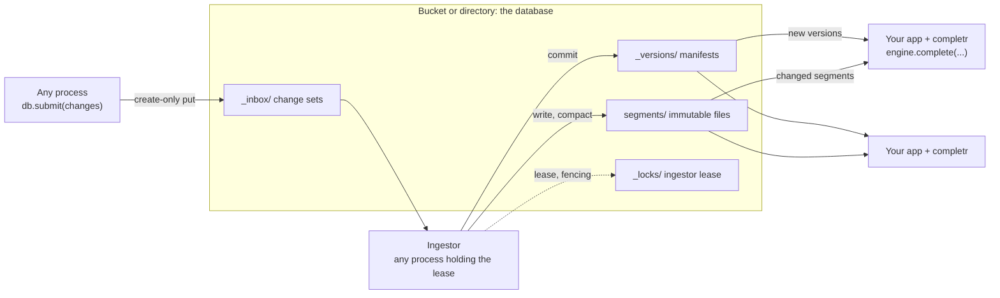

# Many writers

Every transaction is a commit, and commits from many processes contend on the next manifest. For many
processes writing small changes at a high rate, completr has an inbox instead: any process submits a
`ChangeSet` without committing it, and an `Ingestor` commits pending change sets in order. Only the
process holding the ingestor lease acts, so many processes can run one safely.



!!! warning "Run ingestors outside serving processes"
    Building segments and compacting indexes use far more memory and CPU than serving. Build and
    compaction peaks belong to the ingestor, so run ingestors in separate processes (a worker, a cron job
    or `completr ingest`), not inside the processes that answer completion requests.

| Role | Runs | Where |
|---|---|---|
| Serving | `engine = db.engine()` once, then `engine.complete(...)` per request | Every process that answers completions |
| Submitting | `db.submit(changes)` | Any process that changes data: an API handler, a queue consumer, a batch job |
| Ingesting | `Ingestor(db, owner).run_once()` in a loop | One or more worker processes, outside serving processes |
| Maintenance | `db.cleanup(...)` on a schedule | A cron job or the ingestor's worker |

## Submitting changes

A `ChangeSet` holds upserts and deletes for one or more indexes, applied together. `db.submit(changes)`
writes it to the database's `_inbox/` and returns its id. It does not wait for a commit. Change sets from
one process apply in submission order, and later change sets win per document id.

=== "Python"

    ```python
    import completr
    from completr import ChangeSet, Ingestor

    db = completr.connect("./data")
    changes = ChangeSet()
    changes.upsert("songs", [{"id": "billie", "text": "Billie Jean – Michael Jackson", "popularity": 0.9, "contexts": ["pop"]}])
    changes.delete("songs", ["s42"])
    change_set_id = db.submit(changes)
    print(db.pending_change_sets())
    ```

=== "Rust"

    ```rust
    use completr::{key_id, ChangeSet, Document};

    let mut changes = ChangeSet::new();
    changes
        .upsert("songs", [Document::keyed("billie", "Billie Jean – Michael Jackson", 0.9)])
        .delete("songs", [key_id("s42")]);
    database.submit(changes).await?;
    ```

```text
1
```

`ChangeSet.upsert` takes `vectors=` like `Transaction.append`. A change set can also override a shared
index for one tenant, as [layers](layers.md) do:

```python
changes = ChangeSet()
changes.upsert("radio", [{"id": "bohemian", "text": "Bohemian Rhapsody (Remastered 2011) – Queen"}])   # rename for radio only
changes.delete("radio", ["killer"])                                                                    # hide for radio only
db.submit(changes)
```

## Running ingestors

An `Ingestor` commits pending change sets while it holds the database's `ingestor` lease. Every round
takes or renews the lease, folds up to `max_change_sets` change sets into one commit, deletes them from
the inbox, and compacts the indexes it touched (disable with `compact=False`). You may run several
ingestors for availability: only the lease holder acts, and another takes over within
`lease_ttl_seconds` (30 by default) when it stops.

=== "Python"

    ```python
    ingestor = Ingestor(db, "ingestor-1")
    print(ingestor.run_once())
    print(ingestor.run_once())
    ingestor.release()
    ```

=== "Rust"

    ```rust
    use completr::{IngestStep, Ingestor};

    let mut ingestor = Ingestor::new(database.clone(), "ingestor-1");
    if let IngestStep::Committed { version, .. } = ingestor.run_once().await? {
        println!("committed version {version}");
    }
    ingestor.release().await?;
    ```

```text
{'step': 'committed', 'version': 1, 'change_sets': 2, 'documents': 2}
{'step': 'idle'}
```

| `step` | Meaning |
|---|---|
| `standby` | Another ingestor holds the lease. |
| `idle` | The inbox was empty. |
| `committed` | Change sets were committed; the result also has `version`, `change_sets` and `documents`. |

In a real deployment, the ingestor runs in its own process and calls `run_once()` in a loop:

<!-- skip-test -->
```python
import time

ingestor = Ingestor(db, "worker-1", lease_ttl_seconds=30.0)
try:
    while True:
        step = ingestor.run_once()   # {'step': 'standby' | 'idle' | 'committed', ...}
        if step["step"] != "committed":
            time.sleep(1.0)
finally:
    ingestor.release()
```

Commits carry the lease generation as a fencing token, so an ingestor that lost its lease cannot commit,
and a change set left over after a crash is never applied twice. Call `run_once()` well within
`lease_ttl_seconds`: it renews the lease once a third of the TTL has passed, and loses it after the TTL.
The command-line tool runs the same loop: `completr s3://my-bucket/completions ingest --interval 1`.

Serving processes see the commits on their engine's next sync:

```python
engine = completr.connect("./data").engine()
print([(s.id, s.text, s.kind) for s in engine.complete("bill", ["songs"], contexts=["pop"])])
```

```text
[('billie', 'Billie Jean – Michael Jackson', MatchKind.PREFIX)]
```

## Under asyncio

`AsyncDatabase.run_ingestor` runs one round in a worker thread. An `Ingestor` takes the synchronous
`Database`, which `db.database` returns once the database is open:

<!-- skip-test -->
```python
import asyncio

import completr
from completr import Ingestor

async def ingest():
    db = await completr.AsyncDatabase("s3://my-bucket/completions").open()
    ingestor = Ingestor(db.database, "worker-1")
    try:
        while True:
            step = await db.run_ingestor(ingestor)
            if step["step"] != "committed":
                await asyncio.sleep(1.0)
    finally:
        ingestor.release()
```

A runnable Rust example of this flow is
[`live_updates.rs`](https://github.com/sayef/completr/blob/main/crates/completr/examples/live_updates.rs).
